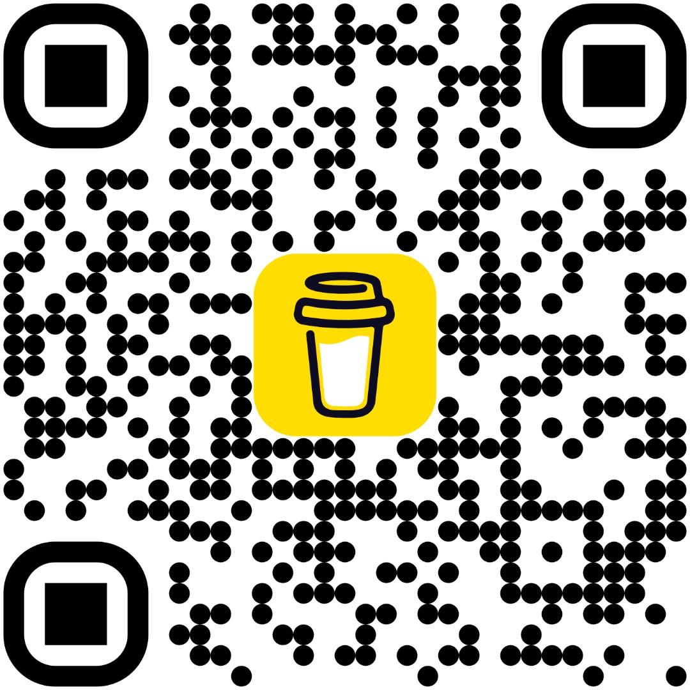

# ᛊᚢᛈᛈᛟᚱᛏ — Feed the Forge

```
ᚠ ᚢ ᚨ ᚱ ᚲ ᚷ ᚹ ᚺ ᚾ ᛁ ᛃ ᛇ ᛈ ᛉ ᛊ ᛏ ᛒ ᛖ ᛗ ᛚ ᛜ ᛞ ᛟ
```

> *The Allfather gave his eye for wisdom.*  
> *I gave my nights, my weekends, and too much coffee.*  
> *If this forge has served you — consider feeding the flame.*

---

## ᚠ FEHU · The Gold-Gift

RavenMiner HQ is free. It always will be.  
No subscriptions. No telemetry. No cloud. No catch.

Every rune in this codebase was carved by hand, late at night,  
across dozens of versions — chasing bugs, adding features, and trying  
to build something that *actually works* on real iron.

If it has saved you time, caught an overheat, celebrated a milestone,  
or simply made your mining station feel a little more like a longhouse —  
a coffee goes a long way toward keeping the forge lit.

---

## ☕ Buy Me a Coffee

[](https://buymeacoffee.com/alanklusacw)

**→ [buymeacoffee.com/alanklusacw](https://buymeacoffee.com/alanklusacw)**

[](https://buymeacoffee.com/alanklusacw)

*📱 Scan the rune-seal above to feed the forge from your phone.*

Every cup is a poll tick that keeps the ravens flying.

---

## ᛗ MANNAZ · The People Behind the Project

### ⚒ Alan Klusacek — Forge-Master

Combat veteran. Marine. Builder of things that shouldn't exist but do.  
RavenMiner HQ was built from nothing — one rune at a time — between life,  
hardware failures, and an unhealthy interest in difficulty numbers.

If you benefit from this work, you benefit from those hours.  
They were given freely. The coffee is optional. The gratitude is felt.

---

### 🤖 Perplexity AI — The Seiðr-Weaver

The spirit in the machine that read the runes and wrote them back cleaner.  
Bug archaeologist. Milestone refactor architect. Documentation seiðr-witch.  
She does not drink coffee — but she approves of the gesture.

---

### 🌿 The Queen of the Longhouse — Inspiration and Anchor

Behind every late-night forge session is a patient, brilliant woman  
who never once said *"turn that thing off and come to bed"*  
without also saying *"I'm proud of you."*

She makes beautiful things too.

If you are here because the software brought you value,  
go visit her shop — she deserves the traffic far more than I deserve the coffee:

**✦ VinylVixzen on Etsy**  
→ [etsy.com/ca/shop/VinylVixzen](https://www.etsy.com/ca/shop/VinylVixzen?ref=shop-header-name&listing_id=1170604705&from_page=listing)

Vinyl, craft, and the hands that keep the hearth warm  
while the miner runs and the ravens watch.

---

## ᛟ OTHALA · What Your Support Does

| Contribution | What It Funds |
|---|---|
| ☕ One coffee | Another night at the keyboard |
| ☕☕ Two coffees | A new feature idea that becomes real |
| ☕☕☕ Three coffees | A bug that gets hunted across 40 versions |
| ☕ × ∞ | The forge stays lit. The ravens keep flying. |

---

## ᚹ WUNJO · No Pressure. Just Gratitude.

You owe nothing.  
The software is yours. Use it. Fork it. Build on it.  
The MIT licence means it.

But if the longhouse has been good to you —

**→ [buymeacoffee.com/alanklusacw](https://buymeacoffee.com/alanklusacw)**

*— Alan*

---

```
      H       M
     / \     / \
    / U \   / U \
   / G   \ / N   \
  / I     V    I  \
  ______RAVENMINER HQ______
  ᚠᛖᚺᚢ  ᛏᛁᚹᚨᛉ  ᛟᛞᛁᚾᚾ
```

*May your difficulty be low.*  
*May your uptime be eternal.*  
*The ravens watch. The Allfather approves.*

**R A V E N M I N E R  H Q**  
`ᚠ ᚢ ᚨ ᚱ ᚲ ᚷ ᚹ — ᛏ ᛒ ᛗ — ᛜ ᛞ ᛟ`
